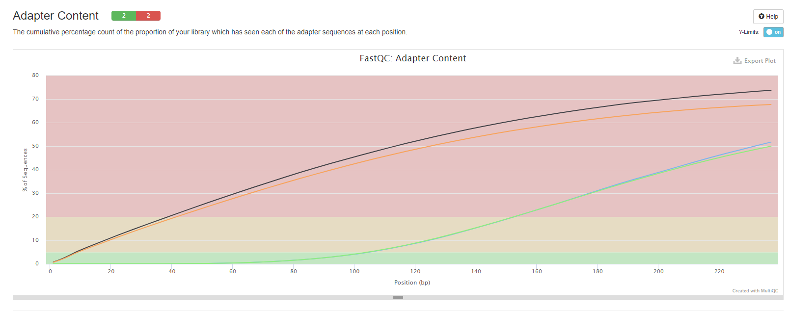

# HSE21_HW1
Выполнил: Динеев Владислав, 2 подгруппа

## До подрезания




## После подрезания


```bash
ln -s /usr/share/data-minor-bioinf/assembly/oil_R1.fastq
ln -s /usr/share/data-minor-bioinf/assembly/oil_R2.fastq
ln -s /usr/share/data-minor-bioinf/assembly/oilMP_S4_L001_R1_001.fastq 
ln -s /usr/share/data-minor-bioinf/assembly/oilMP_S4_L001_R2_001.fastq 

seqtk sample -s1510 oil_R1.fastq 5000000 > sub1.fq
seqtk sample -s1510 oil_R2.fastq 5000000 > sub2.fq
seqtk sample -s1510 oilMP_S4_L001_R1_001.fastq 15000000 > submp1.fq
seqtk sample -s1510 oilMP_S4_L001_R2_001.fastq 15000000 > submp2.fq

mkdir fastqc
*.fq | xargs -P 4 -tI{} fastqc -o fastqc {}

mkdir multiqc
multiqc -o multiqc fastqc

platanus_trim sub1.fq sub2.fq
platanus_trim_internal submp1.fq submp2.fq 
platanus_internal_trim submp1.fq submp2.fq 

mkdir trimmed_fastqc
trimmed_fastqc/* | xargs -P 4 -tI{} fastqc -o trimmed_fastqc {}
mkdir trimmed_fastq
mv -v *trimmed trimmed_fastq
ls trimmed_fastq/* | xargs -P 4 -tI{} fastqc -o trimmed_fastqc {}

mkdir trimmed_multiqc
multiqc -o trimmed_multiqc trimmed_fastqc

platanus assemble -f sub1.fq sub2.fq
platanus scaffold -c out_contig -IP1 sub1.fq sub2.fq -IO2 submp1.fq submp2.fq
platanus gap_close -c out_scaffold.fa -IP1 sub1.fq sub2.fq -IO2 submp1.fq submp2.fq

echo scaffold1_len3831121_cov231 > _tmp.txt
seqtk subseq out_scaffold.fa _tmp.txt > longest.fa

echo scaffold1_cov231 > _tmp.txt
seqtk subseq out_gapClosed.fa _tmp.txt > longest_gap_closed.fa
```

## [Coogle Colab](https://colab.research.google.com/drive/1bgyaB3h2JO3kwBMoRZxTisl4d4BtPcTe?usp=sharing)
```bash
import numpy as np
from pathlib import Path
import re

contig = !grep '^>' out_contig.fa
scaffold = !grep '^>' out_scaffold.fa

def count_stats(names):
  lengths = np.sort([int(w.split('_')[1].lstrip('len')) for w in names])

  half = np.sum(lengths)/2
  count = 0
  N50 = -1
  for l in lengths:
    count += l
    if count >= half:
      N50 = l
      break;
  
  print(f"Общее кол-во: {len(lengths)}")
  print(f"Общая длина: {np.sum(lengths)}")
  print(f"Самый длинный: {np.max(lengths)}")
  print(f"N50: {N50}\n")

count_stats(contig)
count_stats(scaffold)

def count_gaps(scaf):
  gaps = re.findall('[N]+', scaf)
  print(f'Кол-во gaps: {len(gaps)}')
  print(f'Кол-во N: {scaf.count("N")}\n')

longest = Path('longest.fna').read_text().split('\n')[1]
longest_gap_closed = Path('longest_gap_closed.fna').read_text().split('\n')[1]

print("До gap_close:")
count_gaps(longest)
print("После gap_close:")
count_gaps(longest_gap_closed)
```


```bash
Общее кол-во: 626
Общая длина: 3925565
Самый длинный: 179304
N50: 47993

Общее кол-во: 69
Общая длина: 3872152
Самый длинный: 3831121
N50: 3831121

До gap_close:
Кол-во gaps: 65
Кол-во N: 6156

После gap_close:
Кол-во gaps: 6
Кол-во N: 1291
```